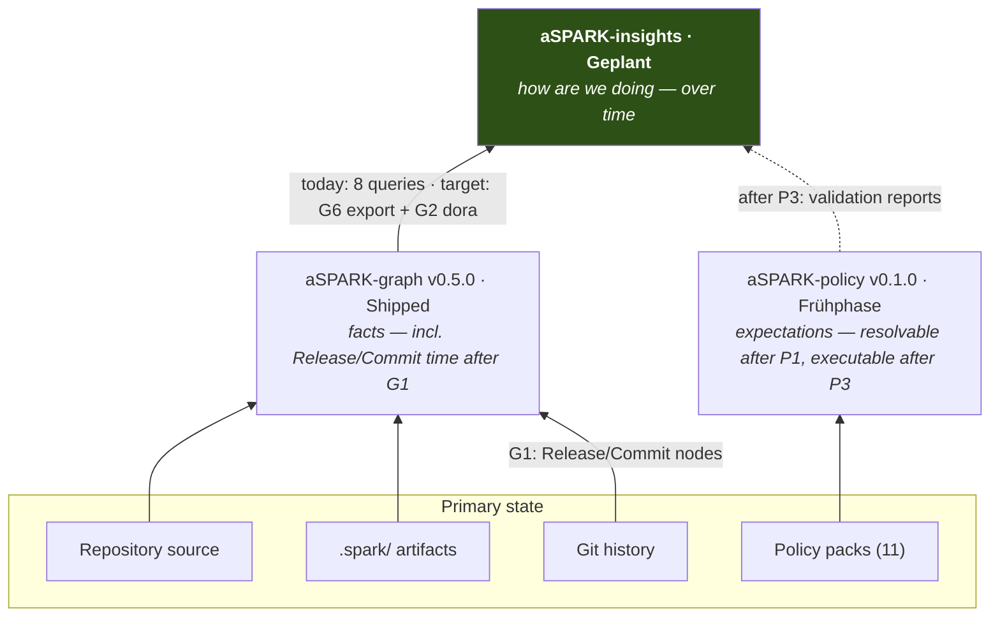
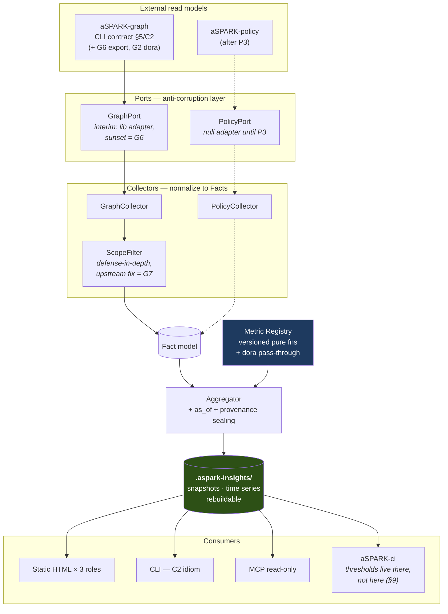

# aSPARK-insights — Architecture Proposal

> **Status:** Draft 2 · co-evolution edition · not yet approved
> **Date:** 2026-07-25
> **Reifegrad (Vertrag §5/C4):** Geplant → wird mit Increment I1 „Frühphase"
> **Normative context:**
> 1. `~/aSPARK Doku/REVIEW-RESPONSE.md` — the master document; sole source of cross-repo contracts (§5)
> 2. *aSPARK Enterprise Architecture Handbook v1.0* — §3.5, §6.4.3, §7.2, §16.1 (target architecture)
> 3. The sibling backlogs: Core C1–C4, graph G1–G5, policy P1–P6
>
> **What changed from Draft 1:** Draft 1 treated the sibling products as frozen external
> dependencies and designed workarounds. That assumption was wrong — the platform is under
> construction and coordinates through backlogs. Draft 2 plans *with* the family instead of
> *around* it: two ADRs flip (ADR-1, ADR-2), one handbook contract is proposed for
> retirement (§7.3 metrics feed), and every gap now maps to a backlog item — existing or
> newly proposed in [CROSS-REPO-PLAN.md](CROSS-REPO-PLAN.md).

---

## 1. Purpose

> aSPARK-insights answers **"how are we doing?"** — deterministically, from evidence the
> delivery process already produced, and never from ticket metadata.

The handbook (§3.5) assigns Insights five responsibility areas: engineering KPIs, delivery
analytics, architecture health, traceability coverage and technical-debt indicators. The
master document's guiding principle binds this product doubly:

> **„Nichts Neues, bis das Ausgelieferte verbunden ist."**

Insights *is* connecting-the-shipped, productized: it wires the graph's existing queries,
the coming Release/Commit layer (G1/G2) and — later — policy validation results (P1–P3)
into visible value. Its v1 must therefore introduce as little new machinery as possible and
consume as much planned machinery as it can. Where Draft 1 said "the sibling doesn't ship
X, work around it," Draft 2 says "X is item G*/P*/C* — sequence against it, or propose it."

**Positioning guardrail** (master doc §3: *"Zwei Produkte, ein Beweis"*): publicly, Insights
stays **Geplant** until it produces real numbers. The v1 target is dogfood — KPIs computed
on the aSPARK family's own repos — before any outward claim. Advertising a third product
prematurely would spend exactly the credibility the evidence trail earns.

---

## 2. Alignment check — gaps mapped to the platform plan

Draft 1's "reality check" treated every gap as a permanent fact. Revalidated: every gap is
either **already planned**, **newly proposed** (→ [CROSS-REPO-PLAN.md](CROSS-REPO-PLAN.md)),
or **proposed for retirement**. Verified against code and backlogs on 2026-07-25.

| Gap (verified) | Plan status | Insights consequence |
|---|---|---|
| Graph has no `Release`/`Commit` nodes, no timestamps beyond `QACheck.date` | **Planned: G1 `release-nodes` (Sofort)** — Release with `version/status/date/commit`, Commit with `sha/date/author_date`, edges `released_as`, `part_of`. Vocabulary reserved in Vertrag §5/C3 explicitly "für insights". | Flow metrics wait for G1 — they do **not** get a second git parser in Insights (ADR-2, flipped) |
| No DORA metrics anywhere | **Planned: G2 `dora-query` (Sofort, after G1)** — Deployment Frequency, Lead Time, Change Failure Rate as a graph query; MTTR honestly `null`. | Insights **wraps** `query dora`, never recomputes it (§4.0 boundary). MTTR stays `null` in every dashboard — the honesty is the product |
| Commit→Feature linkage says nothing about *which artifact* a commit touched → phase durations not derivable | **Gap in G1's scope** | Proposed: `touches`-attribute on `part_of` (→ CROSS-REPO-PLAN, G1 scope note). Fallback if declined: thin git adapter in Insights, explicitly marked interim |
| No bulk read contract; the 8 queries are per-story/per-feature (normative surface fixed in Vertrag §5/C2) | Not planned | **Proposed: G6 `export-query`** — the canonical graph document as published CLI output. Until then: library adapter behind a port, with sunset condition (ADR-1) |
| `graph.json` carries no provenance (builder version, source commit, digest) — handbook §10.3 admits "planned" | Not in any backlog | **Proposed: G8 `provenance-header`.** Interim: Insights self-records git HEAD + file digest |
| 49 of 98 File nodes are worktree duplicates (see §2.1) | Not planned | **Proposed: G7 `scope-excludes` (Sofort)** — this is a data-quality bug for *every* consumer incl. C1 graph-gates, not an Insights nicety |
| No policy resolver/validator — `src/aspark_policy` is 8 lines of Python | **Planned: P1 `resolve-cli` (Sofort) → P2 `check-honesty` → P3 `check-compiler`** | Compliance metrics are increment I8, sequenced after P3. P3's report shape becomes the validation contract — propose recording it in §5 when it ships |
| `Policy`/`PolicyViolation` graph nodes | **Deliberately blocked** (graph backlog §4) until policy has stable pack/rule identifiers (after P1/P2) | I8 additionally waits for this unblock — correct per the family's own sequencing, don't fight it |
| Core emits no metrics/telemetry events (handbook §7.3 "Metrics contract") | **Not in Core's backlog — and no longer needed.** G1/G2 (git-derived time in the graph) + artifact statuses cover what §7.3 promised. | **Propose retiring §7.3's Metrics contract in the handbook** (fits Core item C2 `handbook-maturity`). Building Insights *removes* a planned contract instead of adding one |
| `check: review` class (P2) — many compliance controls are judgment, not mechanics | Planned: P2 | Violation metrics must segregate `review`-class findings from mechanical ones — a KPI that averages both would fake precision (MTA-004) |

### 2.1 The data-quality finding (unchanged from Draft 1, now actionable)

Verified against `aSPARK-graph/.aspark-graph/graph.json`:

```
File nodes total:                          98
File nodes inside .claude/worktrees:       49
Worktree files shadowing a real file:      49   ← 100 %
```

Half the code layer is a duplicate of the other half (a Claude Code worktree was indexed
alongside the real tree). Every coupling/fan-in/duplication metric would be wrong by ~2×,
and `impact`/`gate_health` — which Core item C1 is about to wire into the gates — see the
noise today too. Draft 1 answered with an Insights-side filter; Draft 2 keeps that filter as
**defense-in-depth with provenance disclosure** but files the real fix upstream as **G7**,
where it helps every consumer.

---

## 3. Position in the product family



The division of labor, restated with the timing question resolved by G1:

| Source | Question | Status |
|---|---|---|
| **aSPARK-graph** | *What* is true — **and since G1: when it became true** | Shipped / G1–G2 Sofort |
| **aSPARK-policy** | What *should* be true | P1–P3 planned |
| **aSPARK-insights** | **How are we doing** — definitions, time series, presentation, joins | This proposal |

Insights remains a **read model over read models**: `.aspark-insights/` is deletable at any
time, rebuild is deterministic (P1/P8).

---

## 4. Architecture decisions

### ADR-0 — The product boundary: graph ships *fact queries*, Insights ships the *analytics product*

New in Draft 2, because G2 (`dora-query` in the graph) forces the question Draft 1 dodged:
if the graph computes DORA, what is Insights?

**Decision.** The boundary is not "who computes numbers" but **what kind of statement the
number makes**:

- **aSPARK-graph** answers with *facts about one repository state*, computed from its own
  build inputs — including aggregate facts like `dora`'s raw values. Fact queries live in
  the graph; that is exactly the "one read model, many readers" clause (handbook §3.3.2).
- **aSPARK-insights** owns everything that makes facts *comparable and consumable*:
  versioned metric **definitions** (what counts as covered, which direction is good, what
  threshold matters), **time series across builds** (snapshots), **cross-product joins**
  (graph × policy × future memory), **meta-metrics** (n, freshness, exclusions), and
  **presentation** (role dashboards, MCP, JSON feed).

Concretely: Insights calls `query dora` and wraps its raw values in registry entries with
definition versions and provenance — it never re-derives lead time from commits itself.
Duplicate derivation would create two sources of truth for the same fact, the exact silo
disease the platform exists to cure.

**Consequence for the handbook** (→ Core item C2): §3.5's KPI list and §6.4.3 should carry
this boundary sentence, so graph and Insights don't drift into each other's lane.

### ADR-1 — Consume the graph via its **published contract**; propose `export` for bulk *(revised)*

**Decision.** Insights is a CLI/MCP consumer of aSPARK-graph per Vertrag §5/C2 (JSON on
stdout, `sort_keys`, exit 1 on unbuilt graph, `{"found": false, "reason": …}`). For bulk
reads it needs one thing the contract lacks: **G6 `export-query`** — the canonical graph
document (nodes + edges, the same content `graph.json` persists) as published CLI output.
One subprocess, whole graph, contract-clean.

**Interim** (until G6 ships): a library adapter (`import aspark_graph`) behind a
`GraphPort`, version-pinned, isolated in one file. This is knowingly the coupling §7.4
warns about, so it carries a **sunset condition**: the adapter file doubles as the
requirements list for G6, and dies when G6 lands. Its existence is recorded in every
snapshot's provenance (`"graph_access": "library-interim"`).

**Rejected — parse `.aspark-graph/graph.json` directly.** Hard §7.4 violation with no
expiry; breaks silently on format changes between minors.
**Rejected — per-node CLI calls for everything.** O(features × stories) subprocesses; the
per-feature queries (`gate_health`, `story_trace`) are used where they fit, but coverage
metrics need the full document.

*(Draft 1 chose the library import as the permanent mechanism. Wrong under co-evolution:
the contract can grow — so ask it to.)*

### ADR-2 — Time comes from the **graph's Release/Commit layer (G1/G2)**, not from an Insights git parser *(flipped)*

**Decision.** Flow metrics (I3) consume `Release.date`, `Commit.date` and `query dora`
after G1/G2 land — both are **Sofort** priority in the graph backlog, and §5/C3 reserved
their vocabulary "für insights" by name. For phase-level timing (Specify→Plan→Review→Keep
durations, rework), propose a small G1 scope extension: a `touches` attribute on
`part_of` edges recording which artifact class a commit touched (`spec`, `plan`, `review`,
`qa`, `release`, `src`, `test`) — `commits_touching` in `git.py` already knows the paths.

**Rejected — Insights' own `HistoryCollector` over git (Draft 1's choice).** Under the
frozen-siblings assumption it was the only retroactive option. Under co-evolution it is a
second git parser deriving the same facts the graph is about to own — two sources of truth
for "when," in a platform whose selling point is one. It also duplicates the
feature-attribution logic (`commits_touching`, cross-feature collision handling) that the
graph already solved.

**Rejected — Core telemetry feed (handbook §7.3).** Not in Core's backlog, architecturally
alien to a stateless engine whose state *is* the artifacts, and now redundant: git-derived
time in the graph covers it retroactively, which events never could. → propose retirement
via C2.

**Fallback.** If the `touches` extension is declined, Insights ships a thin, explicitly
interim git adapter for phase timing only — the decision is recorded here so it can't
silently rot into a permanent second parser.

**Accepted cost.** I3 is gated on G1/G2. Acceptable: I1/I2 (traceability) run against
v0.5.0 today, and G1/G2 are the graph's own next work anyway.

### ADR-3 — Metrics are a **versioned registry of pure functions** *(unchanged, sharpened)*

Every KPI is a declarative, individually versioned registry entry:

```python
Metric(
    id="TRC-002",
    name="Acceptance-criterion QA coverage",
    version="1.0.0",
    definition="Share of AcceptanceCriterion nodes with >=1 incoming `verifies` edge.",
    inputs=(FactKind.AC, FactKind.VERIFIES_EDGE),
    unit=Unit.RATIO, direction=Direction.HIGHER_IS_BETTER,
    compute=lambda facts: ...,      # pure; no I/O, no clock, no network
)
```

Definitions-as-versioned-content mirrors policy packs (§9.1) and skills/templates (§12.3):
"coverage dropped" stays distinguishable from "we changed how we measure coverage";
enterprises extend via **metric packs** instead of forks (P6 applied to measurement); pure
`facts → value` functions are trivially CI-testable. Where the graph already ships an
aggregate (dora), the registry entry is a **pass-through wrapper** — definition version and
provenance added, computation not repeated (ADR-0).

### ADR-4 — `as_of` is an **input**, never an ambient clock read *(unchanged)*

No `datetime.now()` anywhere in derivation. Metrics needing "today" (open-finding age,
WIP, exception expiry) take an explicit `as_of`, sealed into snapshot provenance.
`insights build --as-of 2026-06-30` reproduces June's dashboard bit-for-bit, forever. This
is P1 made mechanical in a product whose subject matter is time.

### ADR-5 — Dashboards are **self-contained static HTML** *(unchanged, still challengeable)*

`insights render` emits one self-contained HTML file per role view (plus the underlying
JSON). No CDN, no server, no second toolchain — offline-first (P2) and air-gap (§15.3) for
free; attachable to a PR or an audit package. A served/fleet mode reuses the same JSON
later; only `render/` would change. **Open question 1 (§13) still decides this.**

### ADR-6 — Family stack and family idiom *(unchanged)*

Python ≥ 3.11, `uv`, `hatchling`, stdlib `argparse`, `pytest`, committed `uv.lock` as the
determinism contract. The CLI mirrors the C2 idiom exactly: JSON on stdout with
`sort_keys=True`, human messages on stderr, exit 1 with a named error when inputs are
missing, `{"found": false, "reason": …}` for misses. A family whose products answer in the
same shape is cheaper to learn and to wire.

---

## 5. C4 Level 3 — component decomposition

Handbook §6.4.3 prescribes Collectors, Aggregator, Dashboards. Draft 2 keeps them, plus
the Ports layer (ADR-1) and the Metric Registry (ADR-3). The Draft-1 `HistoryPort` is
**gone** — ADR-2 moved its job into the graph.



**Time series note.** WIP-over-time and every trend accrue naturally from snapshots taken
over time (each sealed with its `as_of` and inputs); retroactive history exists exactly
where the graph provides dated facts (Commit/Release after G1). Insights never
reconstructs historical file states from git — that would be the second parser again.

---

## 6. Package layout

```
aSPARK-insights/
├── src/aspark_insights/
│   ├── ports/            # ADR-1: the only place siblings are known
│   │   ├── graph.py      #   GraphPort + CLI adapter + interim lib adapter (sunset: G6)
│   │   └── policy.py     #   PolicyPort + NullPolicyAdapter (until P3)
│   ├── model/            # Fact, Snapshot, Provenance, MetricValue
│   ├── collect/          # ports -> Facts; ScopeFilter (§2.1)
│   ├── metrics/          # ADR-3 registry: traceability.py architecture.py flow.py debt.py meta.py
│   ├── aggregate/        # snapshot assembly, time series, provenance sealing
│   ├── store/            # .aspark-insights/ deterministic read/write
│   ├── render/           # ADR-5: static HTML per role + JSON
│   ├── cli.py            # build | query | render | diff | verify   (C2 idiom)
│   └── server.py         # MCP stdio, read-only
├── tests/                # fixtures = miniature repos + golden snapshots
├── docs/                 # this proposal + CROSS-REPO-PLAN.md
├── .spark/               # BACKLOG.md (I1…I9) + per-feature delivery artifacts
└── pyproject.toml        # hatchling; committed uv.lock
```

`.aspark-insights/` joins `.aspark-graph/` as a second derived-state directory under the
three-directory rule (§8.2): git-ignored, deletable, deterministic rebuild.

---

## 7. Metric catalog v1 — availability keyed to backlog items

### Traceability — **available today** (graph v0.5.0)

| ID | Metric | Computation |
|---|---|---|
| TRC-001 | Story → Task coverage | % `Story` with ≥1 incoming `maps_to` |
| TRC-002 | AC → QA coverage | % `AcceptanceCriterion` with ≥1 incoming `verifies` — on the graph repo today: **132 ACs, 16 `verifies` edges**, the headline number this product exists to surface |
| TRC-003 | Task → Code coverage | % `Task` with ≥1 outgoing `implements` |
| TRC-004 | Orphan rate | wraps `gate_health` (`orphan_tasks`, `unverified_acs`) per feature |
| TRC-005 | Evidence confidence mix | `declared` / `extracted` / `inferred` share on trace paths — a trust score *for the KPIs themselves*; rises as C1's `files:` notes spread |

### Delivery flow — **after G1 + G2**

| ID | Metric | Source |
|---|---|---|
| FLW-001 | Deployment frequency | pass-through of `query dora` (ADR-0) |
| FLW-002 | Lead time for changes | pass-through of `query dora` |
| FLW-003 | Change failure rate | pass-through of `query dora` |
| FLW-004 | MTTR | **honestly `null`** — surfaced with the graph's own reason string, never invented |
| FLW-005 | Phase durations | first `Commit.date` per artifact class — needs the `touches` extension (G1 scope note), else interim git adapter (ADR-2 fallback) |
| FLW-006 | WIP | point-in-time from Feature statuses; trend accrues via snapshots |
| FLW-007 | Rework ratio | commits touching `src` dated after last `review`-touching commit — needs `touches` |

### Architecture health — **available today**, honest only with scope hygiene (G7 / ScopeFilter)

| ID | Metric | Computation |
|---|---|---|
| ARC-001 | Import cycles | SCCs over `File --imports--> File` |
| ARC-002 | Instability | `I = Ce/(Ca+Ce)` per module from `imports` |
| ARC-003 | Coupling trend | ARC-002 across snapshots |
| ARC-004 | God-file detection | `contains` degree distribution |
| ARC-005 | Layering violations | needs a declared layer map → policy content, after P3 |

### Debt & quality

| ID | Metric | Status |
|---|---|---|
| DBT-001 | Open-finding density by severity | today (`Finding.severity/.status`) |
| DBT-002 | Finding hotspots | today (`found_in` degree) |
| DBT-003 | Stale artifacts | after G1 (needs `Release.date` + commit dates) |
| DBT-004 | Untested change rate | after G2 (`is_test` attribute ships there) |
| DBT-005 | Policy-violation density | after P3 + graph `Policy` nodes (unblocked by stable rule IDs) |
| DBT-006 | Exception / waiver debt | after P3 (exceptions are P-side records) |

### Meta — measuring the measurement

| ID | Metric | Why |
|---|---|---|
| MTA-001 | Sample size `n` per metric | 7 features is not a trend; the renderer refuses trend lines below threshold |
| MTA-002 | Graph freshness at snapshot | wraps `query staleness`; stale input ⇒ labeled output |
| MTA-003 | Scope exclusions applied | what the ScopeFilter dropped and why (§2.1) |
| MTA-004 | Mechanical vs. judgment share | after P2: fraction of compliance signal that is `review`-class — averaging judgment into mechanics would fake precision |

---

## 8. Determinism and provenance

Every snapshot carries a sealed provenance header — the mechanism that makes §3.5's promise
("a number can always be traced back") literally true:

```json
{
  "provenance": {
    "insights_version": "0.1.0",
    "metric_registry_version": "2026.07.1",
    "as_of": "2026-07-25T00:00:00Z",
    "repo_commit": "7e34413",
    "graph_source": {
      "builder_version": "0.5.0",
      "digest": "sha256:…",
      "access": "cli-export | library-interim",
      "sealed": false
    },
    "policy_versions": null,
    "scope_filter": { "excluded": ["**/.claude/worktrees/**"], "dropped_nodes": 49 }
  },
  "metrics": [ { "id": "TRC-002", "definition_version": "1.0.0", "value": 0.121, "n": 132 } ]
}
```

`graph_source.sealed` flips to `true` when G8 ships and the graph vouches for its own
inputs; until then Insights self-records HEAD + digest and says so. Enforced by a
**determinism canary** in CI (build twice, byte-compare — mirroring the graph's own
rebuild check), plus `insights verify` to re-compute any stored snapshot for audits.

### 8.1 Multi-developer operation — determinism at team scale

Nothing about the single-developer flow changes with a team, because there is no shared
mutable state to contend over: primary state is git, and every derived directory
(`.aspark-graph/`, `.aspark-insights/`) is local to the machine that built it.

- **Same commit ⇒ same numbers.** Two developers on the same commit get byte-identical
  snapshots (the determinism canary enforces exactly this). Different branches get
  honestly different numbers — a dashboard describes the checkout that built it, and
  `provenance.repo_commit` names it. "Looks different on my machine" reduces to `git diff`.
- **Team truth lives on `main`, rendered by CI.** One job per merge —
  `aspark-graph build . && insights build --as-of <commit-date> && insights render` —
  publishes the dashboards as a build artifact. Determinism makes CI's numbers provably
  equal to any local rebuild of the same commit — the same property handbook §9.4 uses to
  keep local policy validation and CI enforcement consistent. `--as-of` in CI is the
  **commit date**: an input, never the runner's clock (ADR-4).
- **Team-complete by construction** (the quiet ADR-2 dividend). Git-derived time counts
  every commit regardless of whose machine produced it or whether it was online. The
  rejected event-feed design would have needed collection from every laptop — vacations
  and offline work would have been holes in the team's metrics.
- **Concurrency needs nothing new.** Stories are the unit of concurrency (handbook §11.5):
  per-feature artifact folders travel with their branches and merge with the code.
  Insights only reads.
- **The one thing that must move: the time series.** Locally accrued snapshots are
  per-machine; a team's trend history belongs where it is shared. The answer is **CI
  snapshot intake** — per merge (or nightly), snapshots are stored as build artifacts or
  on a metrics branch; local snapshots are throwaway views. Ships in I5 as documented CI
  workflow templates plus time-series assembly from a snapshot directory. *Gating* on any
  of these numbers remains aspark-ci's job (§9).

---

## 9. Non-goals

- **No individual-level productivity metrics. Ever.** Commit data would make
  commits-per-developer trivial; Insights measures **systems, features, code — never
  people**. Measuring individuals corrupts the input the moment people notice and turns a
  governance asset into a surveillance tool. Design constraint, not a setting.
- **No second git parser** (ADR-2). Time is the graph's fact to state.
- **No recomputation of graph-shipped aggregates** (ADR-0). `dora` is wrapped, not cloned.
- **No thresholds-as-enforcement.** Insights states values; *gating* on them is aspark-ci's
  job, consuming Insights JSON (handbook §2.4 non-goals). One product measures, another
  enforces — the P3/P4 separation applied to numbers.
- **Not a BI/warehouse platform.** JSON out; Grafana is the enterprise's choice.
- **No write path into `.spark/`** — strictly read-only over primary state.
- **No ticket-system integration in v1** — ticket metadata is the untrustworthy source this
  product replaces (§2.1.5).
- **No LLM in the derivation path** (P1). AI may read Insights via MCP; it never computes a KPI.
- **No invented metrics where the artifact doesn't exist.** MTTR stays `null` with reason —
  the family's honesty pattern (G2) is also Insights' pattern.

---

## 10. Increment roadmap (I1–I9) with cross-repo gates

Delivered under SPARK in this repo's `.spark/` ([BACKLOG.md](../.spark/BACKLOG.md)).
"Gate" names the sibling item that must land first — see the wave plan in
[CROSS-REPO-PLAN.md](CROSS-REPO-PLAN.md).

| # | Feature | Delivers | Gate |
|---|---|---|---|
| I1 | `foundation` | scaffold, Fact/Snapshot/Provenance model, GraphPort (CLI + interim lib), CLI skeleton, determinism canary | — |
| I2 | `traceability-metrics` | TRC-001…005, MTA-001…003, ScopeFilter, snapshot store — **first real numbers, dogfooded on the family repos** | — (graph v0.5.0 suffices) |
| I3 | `flow-metrics` | FLW-001…007 incl. dora pass-through | **G1 + G2** (+ `touches` for FLW-005/007) |
| I4 | `architecture-health` | ARC-001…004 | G7 (else ScopeFilter-only, disclosed) |
| I5 | `dashboards` | static HTML, 3 role views (Developer / Architect / Eng. Manager); time-series assembly from a snapshot directory; CI workflow templates for team snapshot intake (§8.1) | I2 |
| I6 | `debt-indicators` | DBT-001…004 | I3 |
| I7 | `mcp-server` | read-only MCP over snapshots | I2 |
| I8 | `policy-metrics` | DBT-005/006, ARC-005, MTA-004 | **P1–P3** + graph `Policy` nodes |
| I9 | `fleet` | multi-repo aggregation, served mode | decision §13/1 |

I2 is the proof point: real coverage numbers on aSPARK's own repos with zero sibling
changes required. Everything time-based rides on work the graph has already prioritized.

---

## 11. Cross-repo deltas (summary)

Full paste-ready entries in [CROSS-REPO-PLAN.md](CROSS-REPO-PLAN.md) — in the sibling
backlogs' own format and language, to be merged into the master document and backlogs in
one coordinated step (its §5 rule: contracts change in both repos in the same Zug).

| Target | Delta | Size |
|---|---|---|
| REVIEW-RESPONSE.md | Insights row in Lesereihenfolge + §6 table; new **Vertrag C5** (graph export); `touches` added to Vertrag C3; §7.3-retirement note | small |
| aSPARK-graph backlog | **G6** `export-query` · **G7** `scope-excludes` (Sofort) · **G8** `provenance-header` · scope note on G1 (`touches`) | 3 small items + 1 note |
| aSPARK (Core) backlog | C2 `handbook-maturity`: retire §7.3 metrics contract, add ADR-0 boundary sentence to §3.5/§6.4.3; C4 note: Insights is second consumer of release evidence | notes only |
| aSPARK-policy backlog | P3 note: the check-compiler's report shape becomes the validation contract for Insights — record it in §5 when it ships | note only |
| aSPARK-insights | this proposal + `.spark/BACKLOG.md` (I1–I9) | new |

---

## 12. Risks

| Risk | Impact | Mitigation |
|---|---|---|
| **G1/G2 slip** → I3 blocked | Flow metrics delayed | I1/I2/I4/I5/I7 don't depend on them; both items are the graph's own Sofort priorities; ADR-2 fallback documented |
| **`touches` extension declined** | FLW-005/007 imprecise | Documented fallback: interim git adapter, explicitly sunset-marked |
| **Small-n statistics** (7 features, 39 stories) | Fake precision destroys trust on first contact | MTA-001; renderer refuses trends below threshold; ship "current state" before "trend" |
| **Interim lib adapter outlives G6** | Permanent §7.4 violation | Sunset condition in ADR-1; `graph_access` visible in every snapshot's provenance |
| **Insights markets the platform ahead of its evidence** | Credibility loss (master doc §3) | Reifegrad stays Geplant until I2 dogfood numbers exist; no public claims before |
| **Metric-definition bikeshed** | Debate blocks delivery | ADR-3: definitions are versioned content; ship v1, allow metric-pack overrides, move on |
| **Template drift** breaks graph → breaks Insights | Empty dashboards | Inherit the loud failure (`TemplateDriftError`), never render silently empty; C3/G5 handshake reduces the class |

---

## 13. Open questions

1. **Per-repo transparency or fleet analytics first?** Still the only question that changes
   the architecture (ADR-5, I9 timing) rather than the roadmap. Note §8.1: a *team on one
   repo* is already served by CI snapshot intake — fleet mode is about many repositories,
   not many developers.
2. **Is Insights' `.spark/` public?** Master doc §6 forces a conscious choice per repo.
   This repo is not even `git init`-ed yet — decide before the first push. (Core/graph:
   tracked & public; policy: local.)
3. **Metric packs enterprise-extensible from v1** or built-in catalog first? ADR-3 makes
   either cheap; it's a marketing-of-symmetry question, not architecture.
4. ~~Shared `aspark-common` library?~~ **Withdrawn.** Draft 1 floated it; the family's
   answer is already on record (P5: no coupling-smuggling libraries) — the export contract
   (G6) replaces the need. Deterministic-JSON and provenance idioms are copied per repo,
   which is the family's existing pattern.
